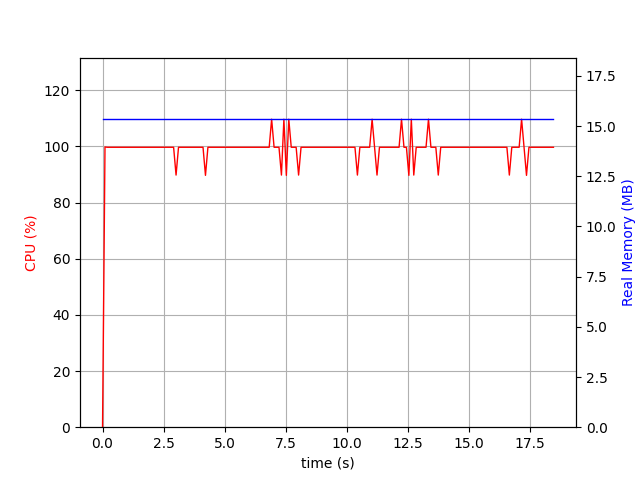
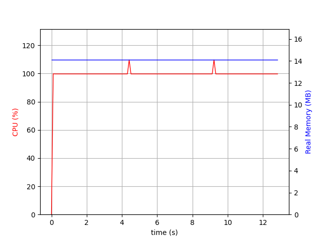
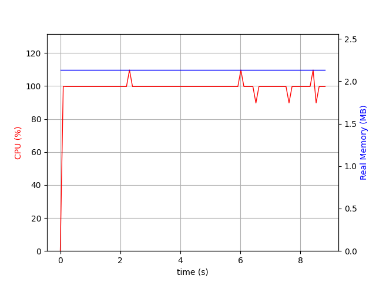
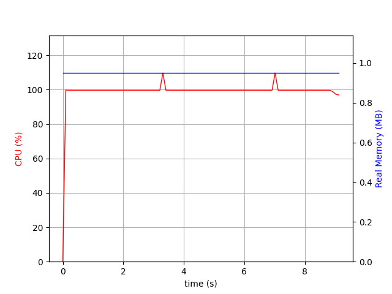
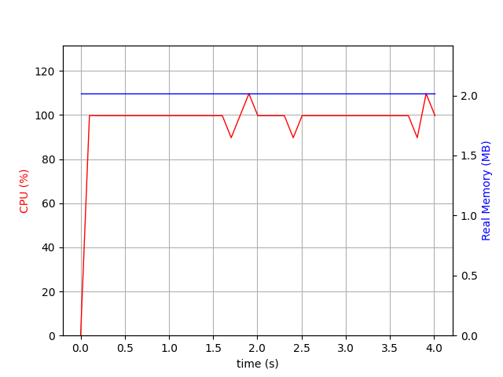
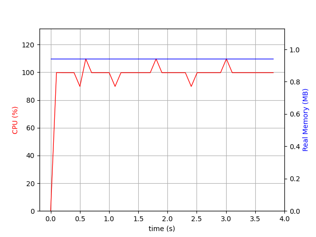

# Rust-or-Cpp
Little research for school to compare the efficiency of Rust and C++. Coded three C++ programs that used different algorithms to generate relatively bad sudokus. After that implemented the same in Rust and compiled everything using the maximum optimization settings. Used `psrecord` to generate graphs of each programs memory as well as CPU usage.

## Results

  <b>C++ vs Rust first algorithm</b>

  
  

  Rust consumes 1MB less memory and executes the program 38% quicker.

  <b>C++ vs Rust second algorithm</b>

  
  

  Execution speed is around the same but C++ user more than double the amount of memory than Rust.

  <b>C++ vs Rust third algorithm</b>

  
  

  Similarly to previous algo, the speed is equal but Rust consumes two times less memory.

  To conclude, it is clear that Rust dominates C++ in these charts and by quite a margin. Therefore Rust is considered to be the more efficent one in this experiment but to be clear it doesn't show us much in general. It is by no means an easy task to name a certain language more efficent than the other due to their complexity and potential performance differences in specific areas. 

